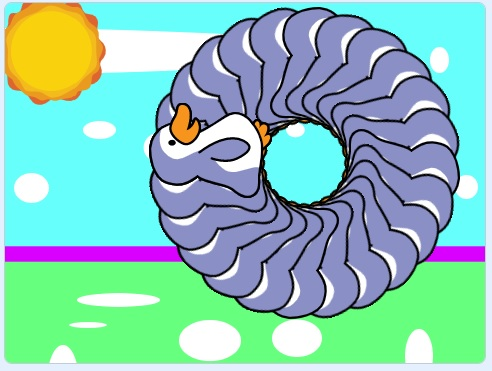
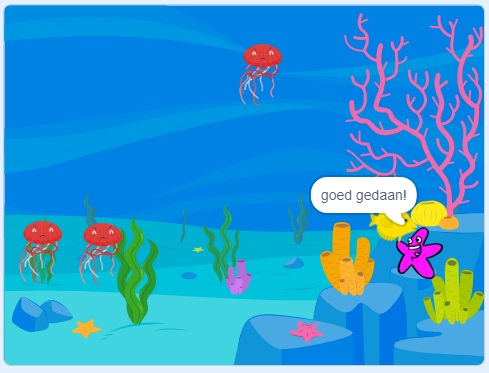
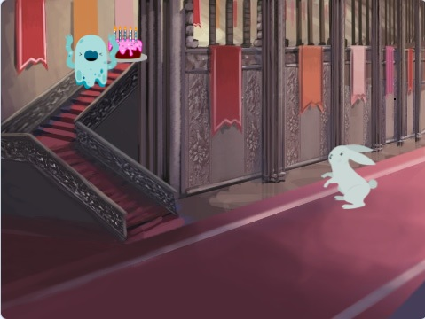

# :mortar_board: Scratch Projecten

:heavy_check_mark: Completed  
:o: Incomplete

## :beginner: Everything Kids’ Scratch Coding Book

1. :heavy_check_mark: THE BASICS OF SCRATCH
2. :heavy_check_mark: MOTION
3. :heavy_check_mark: LOOKS AND ANIMATION
4. :heavy_check_mark: SOUNDS
5. :heavy_check_mark: EVENTS
6. :heavy_check_mark: OPERATORS
7. :heavy_check_mark: CONTROL
8. :heavy_check_mark: SENSING
9. :heavy_check_mark: VARIABLES
10. :heavy_check_mark: MY BLOCKS
11. :heavy_check_mark: EXTENSIONS
12. :heavy_check_mark: IMAGE EDITOR/IMPORTING

### Projecten

- `PenguinDraai.sb3`  
  
- `ZeeParkour.sb3`  
  
- `TaartFeestje.sb3`  
  
- `PartyTunes.sb3`  
  

## :page_with_curl: License

The source code is free -- see the [LICENSE](LICENSE) file for details
